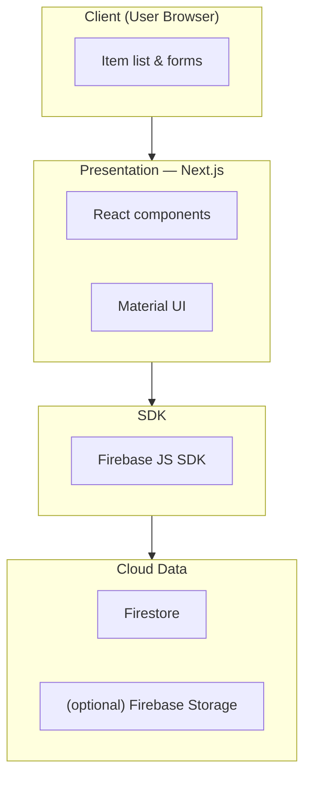
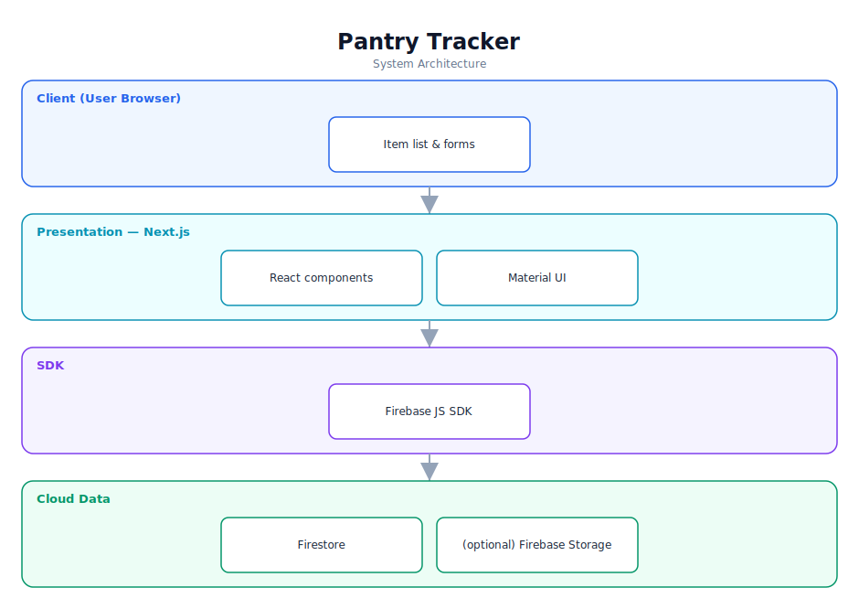

# Pantry Tracker — Software Documentation

> An inventory tracker for pantry items, built with Next.js and Firebase.

**Repository:** [`Pantry_tracker`](https://github.com/Monametsi-s/Pantry_tracker)  
**Type:** Full-stack web application  
**Status:** Functional (documentation light)

---

## 1. Overview

Pantry Tracker is an inventory-management web application (built as a Headstarter AI project) that lets users track pantry items. It uses Next.js for the frontend and Firebase (Firestore) for cloud data storage, enabling create/read/update/delete of items with quantities. (Stack assumed from the project type; confirm against the codebase.)

## 2. System Architecture

The diagram below shows the high-level architecture and how data flows between layers. It renders automatically on GitHub (Mermaid) and is also committed as a vector image ([`architecture.svg`](architecture.svg)).



<p align="center"></p>

### 2.1 Component responsibilities

| Layer | Responsibility |
|---|---|
| **Client** | Lets users add, edit, and remove pantry items. |
| **Presentation (Next.js)** | React components and UI library for layout. |
| **SDK** | Firebase client SDK for data access and auth. |
| **Cloud data** | Firestore stores items; optional Storage for images. |

## 3. Technology Stack

| Area | Technology |
|---|---|
| Framework | Next.js |
| UI | Material UI (assumed) |
| Backend | Firebase Firestore |
| Hosting | Vercel / Firebase Hosting |

## 4. Assumed User Requirements

_These requirements are inferred from the project's purpose and feature set; they document the intended behaviour rather than a formally agreed specification._

### 4.1 Functional requirements

- **FR-01** — Add pantry items with quantities.
- **FR-02** — List current inventory.
- **FR-03** — Update item quantities.
- **FR-04** — Remove items.
- **FR-05** — Persist inventory to the cloud.

### 4.2 Representative user stories

- As a user, I want to know what's in my pantry without checking physically.
- As a user, I want my inventory available on any device.
- As a user, I want to update quantities as I use items.

### 4.3 Non-functional requirements

- Cloud reads/writes should be responsive.
- Firebase credentials must be configured via environment variables.
- The UI must be responsive.

## 5. Assumed System Requirements

### 5.1 End-user (runtime) requirements

- A modern desktop or mobile web browser (latest Chrome, Edge, Firefox, or Safari) with JavaScript enabled.
- A stable internet connection for the initial page load.

### 5.2 Server / hosting requirements

- Firebase project (Firestore enabled).
- A static/SSR host (Vercel or Firebase Hosting).

### 5.3 External services & API keys

- Firebase project config (apiKey, projectId, etc.).

### 5.4 Developer / build requirements

- Node.js 18+ and npm (or yarn/pnpm).
- Git for cloning the repository.
- A code editor such as VS Code (recommended).
- `.env.local` with Firebase config.

## 6. Data Model

Firestore `pantry` collection: { id, name, quantity, (optional) imageUrl, updatedAt }.

## 7. Setup & Installation

```bash
git clone https://github.com/Monametsi-s/Pantry_tracker.git
cd Pantry_tracker
npm install
# add .env.local with your Firebase config
npm run dev
```

## 8. Assumptions & Future Considerations

- Add a real README with screenshots.
- Add search and categories.
- Add image capture + recognition for items.

---

<sub>This document was generated as part of a portfolio-wide documentation pass. User and system requirements are **assumed** from the codebase, README, and project intent, and should be validated against real product goals before being treated as authoritative.</sub>
